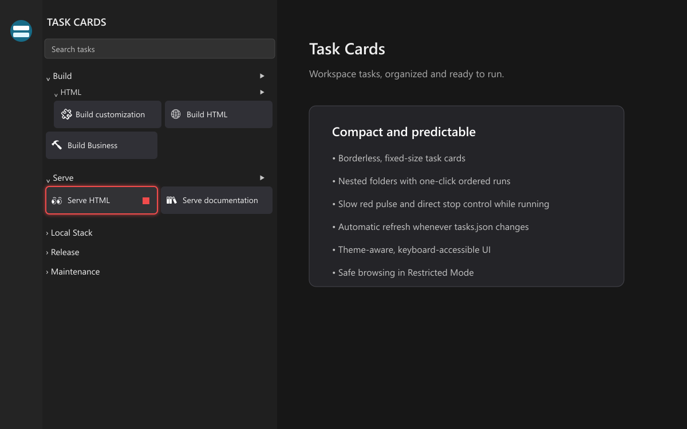

# Task Cards

Task Cards turns tasks declared in each workspace folder's `.vscode/tasks.json` into compact, searchable cards in a dedicated VS Code Activity Bar view.



## Features

- Run a task by clicking anywhere on its card.
- Run every task in a folder, including subfolders, in `tasks.json` order; the sequence stops after the first failure and blocks overlapping card launches.
- Stop a running task directly from its card.
- Show the final folder layout with skeleton cards until VS Code finishes resolving runnable tasks.
- Refresh cards automatically when `.vscode/tasks.json` is saved or changed externally.
- Right-click a card to open its exact definition in `tasks.json`.
- Organize `task-card` tasks into slash-separated nested folders.
- Add an emoji or short text icon to each `task-card` task.
- Require confirmation for sensitive launches.
- Search task names, details, types, folders, and workspace names.
- Keep a stable two-column grid that adapts to one column in narrow sidebars.
- Work with multi-root, local, and remote workspaces.
- Browse task definitions safely in Restricted Mode; execution remains disabled until the workspace is trusted.

## Installation

After Marketplace publication, search for **Task Cards** in the VS Code Extensions view or run:

```sh
code --install-extension DiogoRibeiro.task-cards
```

For local testing, open the Extensions view, select **Views and More Actions…** → **Install from VSIX…**, and choose the packaged `task-cards-*.vsix` file.

## Getting started

Add a `task-card` entry to a workspace folder's `.vscode/tasks.json`:

```jsonc
{
  "version": "2.0.0",
  "tasks": [
    {
      "label": "Deploy production",
      "type": "task-card",
      "command": "npm",
      "args": ["run", "deploy"],
      "folder": "Deploy/Production",
      "icon": "🚀",
      "confirm": "Deploy the production environment?",
      "detail": "Publishes the current release"
    }
  ]
}
```

Open **Task Cards** from the Activity Bar. Click a card to run it, or right-click it to open the corresponding JSON definition.

## `task-card` properties

| Property | Required | Description |
| --- | --- | --- |
| `label` | Yes | Display name and stable identity within the workspace folder. |
| `command` | Yes | Command to execute. |
| `args` | No | Array of command arguments. |
| `execution` | No | `shell` (default) or `process`. |
| `folder` | No | Slash-separated nested folder path. |
| `icon` | No | Emoji or short text displayed on the card. |
| `confirm` | No | `true` for the standard prompt, or a string for a custom prompt. |

Standard VS Code fields such as `options`, `presentation`, `problemMatcher`, `dependsOn`, `runOptions`, and `detail` remain supported.

For shell execution, a `command` without `args` is treated as a complete shell command line, so operators such as pipes and `&&` work normally. When `args` is supplied, VS Code safely constructs the command line from the executable and its arguments.

Ordinary configured task types are also displayed under **Ungrouped**. Custom `folder`, `icon`, and `confirm` properties are available only on `task-card` tasks so that `tasks.json` remains schema-valid.

## Scope and confirmation boundary

Only tasks explicitly declared in a workspace folder's `.vscode/tasks.json` are shown. Auto-detected package scripts, user tasks, and tasks defined only in a `.code-workspace` file are intentionally excluded.

Confirmation is enforced only when a task is launched from Task Cards. VS Code does not let this extension intercept every native execution path, so launches from **Tasks: Run Task**, keybindings, dependencies, or other extensions bypass Task Cards confirmation.

Task Cards targets official desktop VS Code, including remote workspaces. It has no browser extension entry, telemetry, or external network requests.

## Contributing and support

- [Contributing guide](CONTRIBUTING.md)
- [Support](SUPPORT.md)
- [Security policy](SECURITY.md)
- [Release and Marketplace checklist](PUBLISHING.md)

## License

[MIT](LICENSE)
